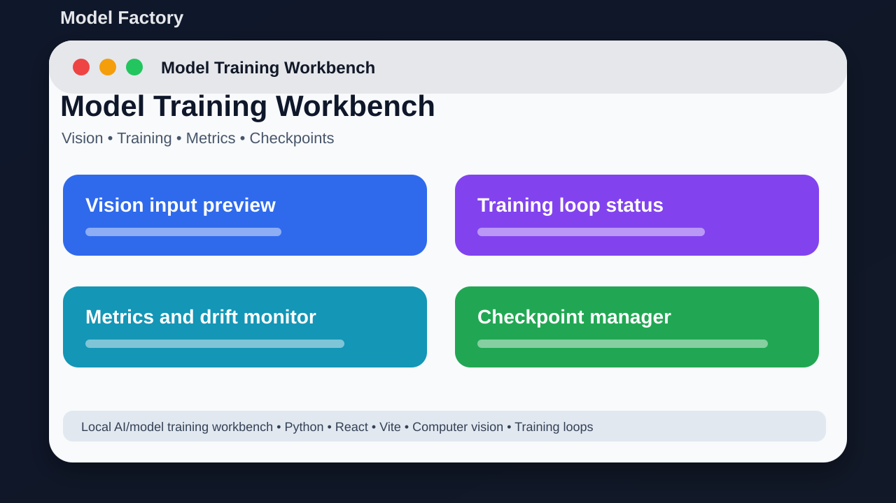

# Model Factory



## Short Description

A local workbench for model experiments, computer vision, training, and dashboards.

## About This Project

Model Factory is a local AI experimentation project. It combines a Python backend, computer vision modules, calibration tools, model/training logic, monitoring tools, checkpoints, and a React frontend.

The goal is to keep the project easy to understand, easy to run, and useful for learning or further development.

## Main Features

- Python launcher and backend modules
- Vision tools for screen/image work
- Training and scoring logic
- Calibration and monitoring tools
- Checkpoint and model management
- React/Vite frontend dashboard
- Optional GPU dependency path

## Tech Stack

- Python
- React
- Vite
- Computer vision
- Training loops

## Project Location

Main local folder:

```text
D:\PROJECTS\ModelFactory
```

GitHub repository:

https://github.com/saifalian/ModelFactory

## Project Structure

```text
backend/       Backend, core logic, database, desktop, and vision modules
frontend/      React/Vite frontend
files/         Extra prompts and UI files
gui.py         Main GUI launcher
settings.json  Local settings
```

## How To Run

1. Create a Python virtual environment.
2. Install requirements.txt.
3. For frontend work, run npm install inside frontend.
4. Run python gui.py or use start.bat.
5. Keep large model files outside Git.

## Screenshot

The image above is a clean project preview for GitHub. It shows the main idea of the project in a simple way.

## Current Status

This project is uploaded to GitHub and prepared as a portfolio-style repository. More improvements can be added later, such as real app screenshots, demo videos, releases, and issue templates.

## Safety Note

This is a local experiment workbench. Review generated model outputs before using them anywhere important.

## License

No license file is included yet. Add a license before using this project as an open-source project.
